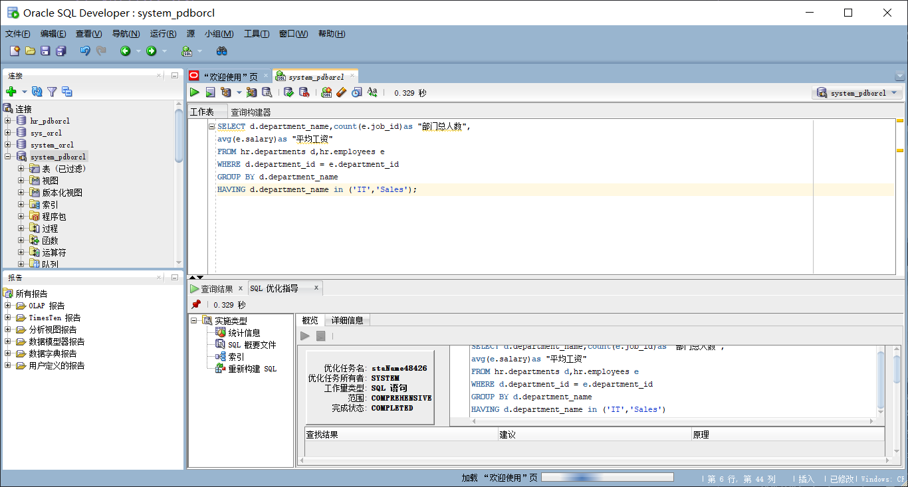

# 马芦 201810414102 2018级软件工程1班
# 我的作业1
我的作业1
# 实验目的
分析SQL执行计划，执行SQL语句的优化指导。理解分析SQL语句的执行计划的重要作用。
# 实验内容
对Oracle12c中的HR人力资源管理系统中的表进行查询与分析。  
首先运行和分析教材中的样例：本训练任务目的是查询两个部门('IT'和'Sales')的部门总人数和平均工资，以下两个查询的结果是一样的。但效率不相同。  
设计自己的查询语句，并作相应的分析，查询语句不能太简单。   
查询代码1：  
set autotrace on  

SELECT d.department_name,count(e.job_id)as "部门总人数",  
avg(e.salary)as "平均工资"  
from hr.departments d,hr.employees e  
where d.department_id = e.department_id  
and d.department_name in ('IT','Sales')  
GROUP BY d.department_name;  
查询代码2：
set autotrace on  

SELECT d.department_name,count(e.job_id)as "部门总人数",  
avg(e.salary)as "平均工资"  
FROM hr.departments d,hr.employees e  
WHERE d.department_id = e.department_id  
GROUP BY d.department_name  
HAVING d.department_name in ('IT','Sales');  
# 关于教材中的代码分析
第一段代码的运行结果如图：

第二段代码的运行结果如图：

两段代码的运行效率相差不大，但第二段代码使用时间较长一点。两段代码的不同之处在于第一个代码的查找条件是where和and结合，第二段代码则使用where和having结合，同样是遍历整张表，两者的运行速度差不多。而having和where的区别在于where:where是一个约束声明,使用where来约束来自数据库的数据;where是在结果返回之前起作用的;where中不能使用聚合函数。having是一个过滤声明;在查询返回结果集以后，对查询结果进行的过滤操作，在having中可以使用聚合函数。因为在查询一遍数据库后，第二段代码的having还要对查询结果进行过滤，所以耗时会长一些。
# 关于两段代码的性能分析
第一段代码的性能分析如图

第二段代码的性能分析如图

总的来说，第一段代码的性能优于第二段代码。第一段代码的Cost=4,Rows=20,4次filter，5次access。第二段代码的Cost=6，Rows=106，1次filter和8次access.第一段比第二段代码优秀。
# 关于教材中两段代码的优化指导建议分析
第一段代码的优化指导建议如图：

第二段代码的优化指导建议如图：

第一段代码比第二段代码优秀，那么我们就可以使用第一段代码。对于第一段代码的优化建议是建立索引并节省空间。可以在hr.departments表中创建department_id和department_name的索引。
# 关于自己的查询代码
查询在主管为145和100下面的员工人数和平均工资  
set autotrace on  
SELECT d.manager_id,count(e.job_id)as "管理总人数",  
avg(e.salary)as "平均工资"  
from hr.departments d,hr.employees e  
where d.manager_id = e.manager_id  
and d.manager_id in ('145','100')  
GROUP BY d.manager_id;  
查询结果如图：

在这之前我们首先要知道表的结构，并且确定自己要查询的东西。并且在hr.departments创建manager_id的索引。所以在查询这段代码之前对这两个表的内容进行了一边查询。在查询完表的结构后，决定查询在不同的主管下面的员工的平均工资。首先要分析我们要查的表为hr.departments和hr.employees两张表，然后去看我们需要查询的东西是管理的总人数和平均工资。管理的总人数可以通过count函数来数有多少个id就有多少人。平均工资可以通过avg这个函数来实现。然后是查询的条件是两个表中的manager_id是对应的，以及它们的id是我们所需要的数字，最后查询结果以manager_id进行分组。  

