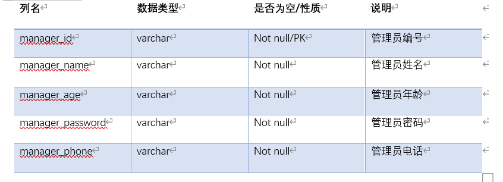

# 马芦 201810414102 2018级软件工程1班
# 我的作业6
# 图书管理系统数据库设计
## 系统概述
本系统是图书管理系统，图书管理是每个图书馆都要做的工作，一个良好的系统能够为管理图书的工作带来便利。本系统是图书管理系统的数据库设计模块，基于Oracle数据库。
## 需求分析
### 功能分析
1.学生可以直接通过借阅终端来查阅书籍信息﹐同时也可以查阅自己的借阅信息。
⒉当学生需要借阅书籍时，通过账号密码登陆借阅系统﹐借阅系统处理学生的借阅﹐同时修改图书馆保存的图书信息,修改被借阅的书籍是否还有剩余,同时更新学生个人的借阅信息。
3.学生借阅图书之前需要将自己的个人信息注册﹐登陆时对照学生信息。
4.学生直接归还图书,根据图书编码修改借阅信息
5.管理员登陆管理系统后，可以修改图书信息﹐增加或者删除图书信息
6.管理品可以注销学生信息。
### 需求分析流程图
#### 数据流图


#### 系统功能模块图

## 数据库设计方案
### 系统E-R图
#### 总体E-R图

#### 读者E-R图

#### 管理员E-R图

### 设计表
#### Student表

#### Book表

#### Book_sort表

#### borrow表储存学生借书信息

#### return_table储存学生还书信息

#### ticket储存学生罚单信息

#### manager 

### 物理模型设计图

## 创建表空间
第一个表空间
```
Create Tablespace space_qhl001
datafile
'/home/oracle/app/oracle/oradata/orcl/pdborcl/pdbtest_qhl001_1.dbf'
  SIZE 100M AUTOEXTEND ON NEXT 256M MAXSIZE UNLIMITED,
'/home/oracle/app/oracle/oradata/orcl/pdborcl/pdbtest_qhl001_2.dbf'
  SIZE 100M AUTOEXTEND ON NEXT 256M MAXSIZE UNLIMITED
EXTENT MANAGEMENT LOCAL SEGMENT SPACE MANAGEMENT AUTO;
```
第二个表空间
```
Create Tablespace space_qhl002
datafile
'/home/oracle/app/oracle/oradata/orcl/pdborcl/pdbtest_qhl002_1.dbf'
  SIZE 100M AUTOEXTEND ON NEXT 256M MAXSIZE UNLIMITED,
'/home/oracle/app/oracle/oradata/orcl/pdborcl/pdbtest_qhl002_2.dbf'
  SIZE 100M AUTOEXTEND ON NEXT 256M MAXSIZE UNLIMITED
EXTENT MANAGEMENT LOCAL SEGMENT SPACE MANAGEMENT AUTO;
```
## 实现表的创建及视图索引的设计
### 创建表
#### 创建读者表
```
CREATE TABLE "SCOTT"."READER"

(

  "STUDENT_ID" INT PRIMARY KEY,

  "STUDENT_NAME" VARCHAR(10) NOT NULL,

  "STUDENT_GENDER" CHAR(2) NOT NULL,

  "STUDENT_AGE" INT NOT NULL,

  " STUDENT_PRO" VARCHAR(20) NOT NULL,

  " STUDENT_GRADE" VARCHAR(20) NOT NULL,

  " STUDENT_INTEGRITY" INT  DEFAULT 1 
) 

TABLESPACE " qhl001";

ALTER TABLE "SCOTT"."READER" ADD CONSTRAINTS "Sex_CK1" CHECK(Sex BETWEEN '男' AND '女');

```
#### 创建书籍表
```
CREATE TABLE "SCOTT"."BOOK"

(

  "BOOK_ID" INT PRIMARY KEY,

  "BOOK_NAME" VARCHAR(30) NOT NULL,

  "BOOK_AUTHOR" VARCHAR(10) NOT NULL,

  "BOOK_PUB" VARCHAR(40) NOT NULL,

  "BOOK_NUM" INT NOT NULL,

  "BOOK_SORT" VARCHAR(40) NOT NULL,

  " BOOK_RECORD" DATETIME 

) 

TABLESPACE " qhl001";

```
#### 创建管理者表
```
CREATE TABLE "SCOTT"."MANAGER"

(

  "MANAGER_ID" INT PRIMARY KEY,

  "MANAGER_NAME" VARCHAR(10) NOT NULL,

  "MANAGER_AGE" INT NOT NULL,

  " MANAGER_PASSWORD" VARCHAR(20) NOT NULL,

  " MANAGER_PHONE" VARCHAR(20) NOT NULL,) 

TABLESPACE " qhl001";

```
#### 创建图书类别表
```

CREATE TABLE "SCOTT"."BOOK"

(

  "SORT_ID" VARCHAR(10) PRIMARY KEY,

  "SORT_NAME" VARCHAR(30) NOT NULLS

) 

TABLESPACE " qhl001";

```
#### 创建借阅表
```
CREATE TABLE "SCOTT"."BORROW"

(

   "READER_ID" INT REFERENCES "SCOTT"."READER"( READER_ID),

   "BOOK_ID" INT REFERENCES "SCOTT"."BOOK"( BOOK_ID),

   "BORROW_DATE" DATETIME,

   "EXPECT_RETURN_DATE" DATETIME

)

TABLESPACE " qhl002";

```
#### 创建归还表
```
CREATE TABLE "SCOTT"."RETURN"

(

   "READER_ID" INT REFERENCES "SCOTT"."READER"( READER_ID),

   "BOOK_ID" INT REFERENCES "SCOTT"."BOOK"( BOOK_ID),

   "BORROW_DATE" DATETIME,

   "RETURN_DATE" DATETIME

)

TABLESPACE " qhl002";
```
#### 创建罚单表
```
CREATE TABLE "SCOTT"."TICKET"

(

   "READER_ID" INT REFERENCES "SCOTT"."READER"( READER_ID),

   "BOOK_ID" INT REFERENCES "SCOTT"."BOOK"( BOOK_ID),

   "OVER_DATE" DATETIME,

   "TICKET_FEE" FLOAT

)

TABLESPACE " qhl002";

```
### 创建索引
#### Student表创建索引
1.为stu_id创建索引，升序排序
```
create index index_id on student(stu_id asc);
```
2.为stu_name 创建索引，并且降序排序
```
alter table student add index index_name(stu_name, desc);
```
#### book表创建索引
1.为book_id创建索引，升序排列
```
create index index_bid on book(book_id);
```
2.为 book_record创建索引，以便方便查询图书的登记日期信息，升序:
```
create index index_brecord on book(book_record);
```
#### borrow表创建索引
1.为stu_id和book_id创建多列索引:
```
create index index_sid_bid on borrow(stu_id asc, book_id asc);
```
#### return表创建索引
1.	为stu_id和book_id创建多列索引∶
```
create index index_sid_bid on return_table(stu_id asc, book_id asc);
```
#### ticket表创建索引
1.为stu_id和book_id创建多列索引:
```
create index index_sid_bid on ticket(stu_id asc, book_id asc);
```
#### manager表创建索引
1.为manager_id创建索引:
```
create index index_mid on manager(manager_id);
```
### 创建视图
1.读者视图在表student, borrow 和book 上创建借书者的全面信息视图stu_borrow :
```
Create force view “scott” ." stu_borrow "
as
select student.stu_id, book.book_id, student.stu_name, book.book_name,
borrow_date , adddate(borrow_date,30) expect_return_date
from student, book, borrow
where student.stu_id = borrow.stu_id and book.book_id = borrow.book_id
when read only;

```
2..创建个人所有借书归还纪录视图stu_borrow_return:
```
Create force view “scott” ." stu_borrow_return"
as 
select
student.stu_id,
student.stu_name,
book.book_id,
book.book_name,return_table.borrow_date,return_table.return_date
from student, book, return_table
where student.stu_id = return_table.stu_id and book.book_id = return_table.book_id
with read only; 

```
  3.创建读者的图书信息查询视图：
  ```
create force view "scott"."v_reader_c1"
as
select "book_id","book_name","book_author","book_pub","book_num" from "scott"."book"
with read only; 

  ```
4.管理者视图在表student, borrow 和book 上创建借书者的全面信息视图stu_borrow :
```
Create force view “scott” ." stu_borrow "
as
select student.stu_id, book.book_id, student.stu_name, book.book_name,
borrow_date , adddate(borrow_date,30) expect_return_date
from student, book, borrow
where student.stu_id = borrow.stu_id and book.book_id = borrow.book_id
with check option;

```
5.创建图书管理员的图书信息查询视图：
```
create force view "scott"." "V_Manager_C1 "
as
select "book_id","book_name","book_author","book_pub","book_num" from "scott"."book"
with check option;

```
## 触发器设计以及储存函数的设计
### 触发器设计
1.	设计触发器borrow，当某学生借书成功后﹐图书表相应的图书不在架上,变为0∶
```
create or replace trigger borrow
after insert on borrow
for each row
begin
update book set book_num = book_num -1
where book_id = new.book_id;
end borrow；

```
⒉设计触发器trigger_return，还书成功后﹐对应的书籍book_num变为1: 
```
create or replace trigger trigger_return
after insert on return_table
for each row
begin
update book set book_num = book_num + 1
where book_id = new.book_id;
end trigger_return;

```
3.定义定时器（事件) eventJob ,每天自动触发一次﹐扫描视图stu_borrow ，若发现当前有
预期归还时间小于当前时间,则判断为超期,生成处罚记录,这个定时器将每天定时触发存
储过程proc_gen_ticket :
```
create event if not exists eventJob
on schedule every 1 DAYl*每天触发**
on completion PRESERVE
do call proc_gen_ticket(getdate());l*调用存储过程*/
set global event_scheduler = 1;
alter event eventJob on completion preserve enable; *开启定时器*

```
4.设计触发器trigger_credit ，若处罚记录超过30条,则将这个学生的诚信级设置为0，下
次不允许借书∶
```
create or replace trigger trigger_credit
after insert on ticket
for each row
begin
if (select count(*) from ticket where stu_id=new.stu_id)>30 then
update student set stu_integrity = 0 where stu_id = new.stu_id;
end if;
end

```
### 储存函数包设计
创建程序包
```
create or replace PACKAGE book_package Is
function func_get_credit(stu_id int) returns int;
function func_get_booknum(book_id int) returns int;
procedure proc_return(in stu_id int, in book_id int, in return_date datetime);
procedure proc_payoff(in stuid int, in bookid int);
  procedure proc_borrow(in stu_id int,in book_id int,in borrow_date datetime);
procedure proc_gen_ticket(in currentdate datetime);
procedure stu_register(in stu_id int,in stu_name varchar(20)，in stu_sex varchar(20), in stu_age int, in stu_pro varchar(20), in stu_grade varchar(20));
procedure ma_register(in ma_id int, in ma_name varchar(20), in ma_age int, in ma_phone int);


end book_package;

```
创建储存过程
```
create or replace PACKAGE body book_package Is
/* 1．设计存储过程，产生罚单proc_gen_ticket :
当日期超过预定归还日期时﹐产生罚单，并将记录写入表ticket中,这个存储过程在定时器
eventJob中调用:  */

procedure proc_gen_ticket(in currentdate datetime)
BEGIN
declare cur_date datetime;
set cur_date = currentdate;
replace into ticket(stu_id, book_id, over_date, ticket_fee)
select
stu_id,
book_id,
datediff(cur_date,stu_borrow.expect_return_date),0.1*datediff(cur_date,stu_borrow.exp
ect_return_date)
from stu_borrow
where cur_date>stu_borrow.expect_return_date;
end proc_gen_ticket;
/* ⒉设计学生注册信息存储过程∶学生注册信息stu_register  */

procedure stu_register(in stu_id int,in stu_name varchar(20)，in stu_sex
varchar(20), in stu_age int, in stu_pro varchar(20), in stu_grade varchar(20))
begin
insert into student(stu_id, stu_name, stu_sex,stu_age, stu_pro, stu_grade)
values(stu_id,stu_name, stu_sex,stu_age,stu_pro,stu_grade);
end stu_register;
/*  3.设计管理员注册信息存储过程:ma_register */

procedure ma_register(in ma_id int, in ma_name varchar(20), in ma_age int, in
ma_phone int)
BEGIN
insert into manager
values(ma_id, ma_name, ma_age, ma_phone);
END ma_register;

/*  4．借书过程的实现:1)设计存储函数, func_get_credit ,返回学生的诚信级︰*/
function func_get_credit(stu_id int) returns int
begin
return(select stu_integrity from student where student.stu_id = stu_id);
end

/* 2)设计存储函数，func_get_booknum ,返回书籍是否在架上:*/
function func_get_booknum(book_id int) returns int
begin
return(select book_num from book where book.book_id = book_id);
end

/*3)设计存储过程proc_borrow ,调用func_get_credit和 func_get_booknum ,判断这
个学生诚信度和书籍是否在架上,若为真,则借书成功,在borrrow表中插入纪录;
否则提示失败︰*/

procedure proc_borrow(in stu_id int,in book_id int,in borrow_date datetime)
begin
if func_get_credit(stu_id)= 1 and func_get_booknum(book_id)= 1 then
insert into borrow
values(stu_id, book_id, borrow_date);
else
select 'failed to borrow';
end if;
end proc_borrow;

/* 5.还书存储过程proc_return :
当还书时,查看是否书是否超期,即查询ticket表项,当发现超期,提示交罚单后再次还书 ，
如没有超期，则纪录归还项目到return_table中，并且删除借书纪录(以免还书后定时器仍
然扫描这个纪录): */
procedure proc_return(in stu_id int, in book_id int, in return_date datetime)
begin
DECLARE borrowdate datetime;
if(select payoff from ticket where ticket.stu_id =stu_idand
ticket.book_id=book_id)= 1 then l*判断是否交了罚单﹐1表示没有交*
select 'please pay off the ticket';
elsel*纪录归还项目到return_table 中，并且删除借书纪录*/
set borrowdate = (select borrow_date from borrow where borrow.stu_id =
stu_id and borrow.book_id = book_id);
insert into return_table
values(stu_id, book_id, borrowdate, return_date);
delete from borrow
where borrow.stu_id = stu_id and borrow.book_id = book_id;
end if;
end proc_return;

/* 6.交罚单存储过程∶修改罚单中payoff 段为0，表明罚单已交∶  */
procedure proc_payoff(in stuid int, in bookid int)
begin
update ticket
set payoff = o
where ticket.stu_id = stuid and ticket.book_id = bookid;
select 'succeed';
end proc_payoff;
end book_package;

```
## 角色分配以及权限赋予

创建学生用户：
```
create user student1
identified by 123
default tablespace users
quota 50M on users
password expire;

create user student2
identified by 123
default tablespace users
quota 50M on users
password expire;

```
创建图书管理员用户：
```
create user manager1
identified by 123
default tablespace users
quota 50M on users
password expire;

 create user manager2
identified by 123
default tablespace users
quota 50M on users
password expire;

```
创建角色：
```
create role student
not identified;
create role manager
not identified;

```
将角色赋予用户：
```
GRANT CONNECT,student TO student1;
GRANT CONNECT,student TO student2;
GRANT CONNECT,manager TO manager1;
GRANT CONNECT,manager TO manager2
```
为角色赋予权限：
```
grant select on "scott"."v_reader_c1" to student;
grant select on "scott"."v_reader_c2" to student;
grant select on "scott"."stu_borrow” to student;
grant select on "scott"." stu_borrow_return” to student;

grant connect,resource,execute to manager;

grant select,insert,delete,update on "scott"."v_manager_c1" to manager;

grant select,insert,delete,update on "scott"." stu_borrow " to manager;

```
## 关于备份
一、原理

写一个数据库备份、删除脚本，加入到windows任务计划里，每天定时执行即可；
二、步骤

1、	新建txt文档，输入如下“oracle数据库定时备份、删除脚本”内容
2、	脚本内容如下
```
@echo off   
echo ================================================   
echo  Windows环境下Oracle数据库的自动备份脚本  
echo  1. 使用当前日期命名备份文件。  
echo  2. 自动删除7天前的备份。  
echo ================================================  
::以“YYYYMMDD”格式取出当前时间。  
set BACKUPDATE=%date:~0,4%%date:~5,2%%date:~8,2%  
::设置用户名、密码和要备份的数据库。  
set USERA=sccot
set PASSWORD=123456
set SID=orcl
::创建备份目录。  
if not exist "C:\oraclebackup\data"       mkdir C:\oraclebackup\data  
if not exist "C:\oraclebackup\log"        mkdir C:\oraclebackup\log  
set DATADIR=C:\oraclebackup\data  
set LOGDIR=C:\oraclebackup\log  
exp %USERA%/%PASSWORD%@%SID%  file=%DATADIR%\%BACKUPDATE%.dmp 
::删除7天前的备份。  
forfiles /p "%DATADIR%" /s /m *.* /d -7 /c "cmd /c del @path"  
forfiles /p "%LOGDIR%" /s /m *.* /d -7 /c "cmd /c del @path"  
exit  

```
3另存为.bat格式
4.windows定时添加任务
